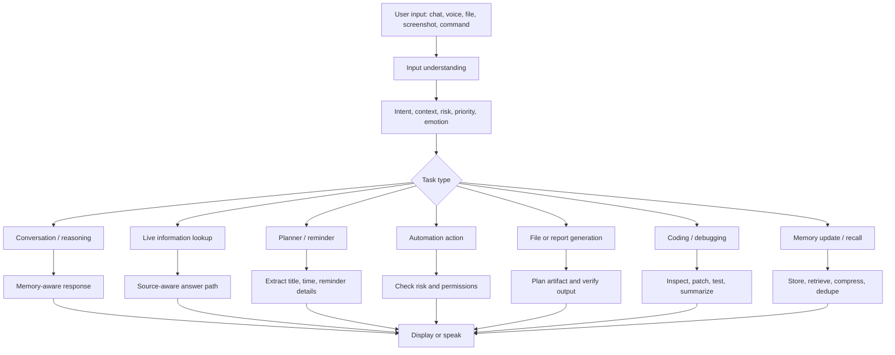
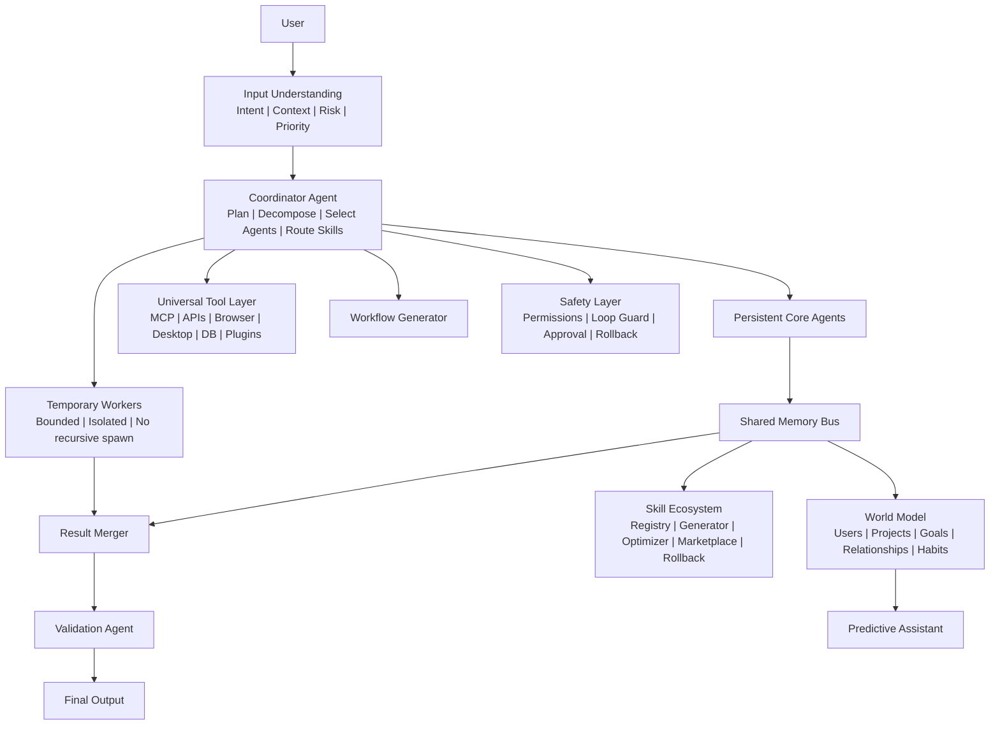
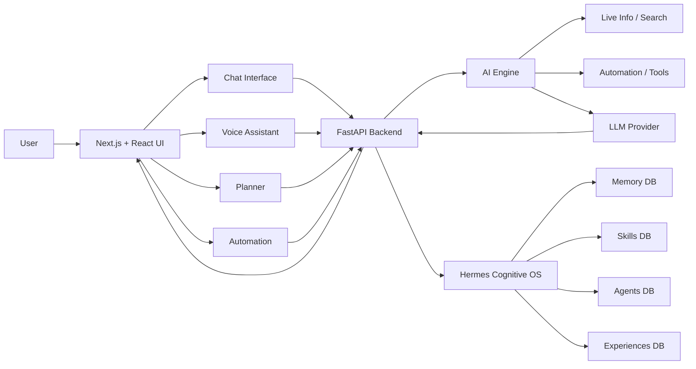

# Akansha

Akansha is a multimodal AI assistant workspace for chat, voice, planning,
automation, memory, live information, file workflows, and cognitive
orchestration. It is built with a Next.js frontend and a FastAPI backend, with
an isolated Hermes cognitive layer for memory, agents, skills, workflow
generation, tool governance, and continuous improvement.

Akansha is not designed as a simple chatbot. It is designed as an AI operating
workspace: it understands intent, chooses the right workflow, uses memory when
useful, checks risk before sensitive actions, routes larger work through agents
and skills, and records lessons so future tasks can improve.

## Current Status

The repository currently includes:

- Chat interface with memory indicators, slash commands, attachments, pinned-message actions, and conversation branching support.
- Voice assistant interface with language, tone, voice profile, transcript, controls, and avatar stage.
- Planner and reminder workflows.
- Browser and desktop automation planning.
- Screenshot/image attachment reasoning surface.
- Authentication screens for sign-in, sign-up, and forgot-password flows.
- Generated-file route for artifacts under `/generated/...`.
- Hermes Cognitive OS backend under `/api/cognitive/*`.
- SQLite-backed memory, skills, experiences, agents, world graph, tools, jobs, and multimodal context stores.
- Regression tests for the cognitive layer and audit behaviors.

Some capabilities depend on provider credentials, browser permissions, OS focus,
microphone permissions, or live data availability. Akansha should verify
important information instead of guessing.

## What Makes Akansha Different

Most AI apps are mainly answer generators: user asks, model replies. Akansha is
different because it is organized around decisions, actions, memory, governance,
and workflows.

| Area | Basic chatbot behavior | Akansha behavior |
| --- | --- | --- |
| Memory | Replays recent chat or forgets context | Stores short-term and long-term memory, deduplicates it, compresses it, and recalls only relevant memories |
| Task handling | Treats every prompt like text | Detects intent: chat, live research, coding, automation, planner, file generation, memory, or safety-sensitive action |
| Tools | Calls a tool directly or not at all | Routes through a governed Universal Tool Layer with approval gates for risky tools |
| Agents | May spawn many uncontrolled agents | Uses persistent core agents plus bounded temporary workers that cannot recursively spawn |
| Learning | Stores success examples only | Records experiences, failures, causes, fixes, rewards, and reflections |
| Skills | Static prompt templates | Versioned skill registry, optimizer, retirement, and marketplace with rollback support |
| Live information | May answer from stale model memory | Detects live/current questions and routes them toward source-backed lookup and validation |
| UI behavior | One fixed interface | Adaptive UI engine can choose coding, research, voice, planning, business, or creative modes |
| Safety | Responds or refuses at the model level | Adds permission checks, loop guards, sensitive-action approval, and risk scoring |

Akansha is built to become a controllable assistant that can reason, plan,
act, verify, and learn from outcomes without turning into an uncontrolled agent
loop.

## Feature Map

| Capability | Present implementation |
| --- | --- |
| Chat | Main chat workspace, slash commands, history, memory indicators, attachments, generated-file links |
| Voice | Voice assistant page, browser speech/TTS integration, language/tone controls, interrupt controls, avatar stage |
| Planner | To-do, calendar, reminders, natural-language title extraction, notification bridge |
| Automation | Browser/desktop action planning, open/search/scroll/form/media/volume workflows, approval for sensitive actions |
| Image and screenshot reasoning | Paste/upload attachment path in chat and multimodal context storage in Hermes |
| Live information routing | Intent detection for latest/current/live/news/score/price/weather questions |
| Document/file workflows | Generated file route and artifact-generation intent for PDF, PPTX, Excel, DOCX, CSV, JSON style requests |
| Memory | Short-term memory, long-term memory, weighted recall, deduplication, compression |
| Cognitive OS | Agents, skills, workflows, failure learning, world model, predictions, tool governance |
| Safety | Permission checks, approval requirements, loop guard, confidence scoring, rollback support |
| Testing | Python unit tests and TypeScript type-check workflow |

## Core Interfaces

| Page | Purpose |
| --- | --- |
| `/chat-interface` | Main chat workspace with slash commands, attachments, generated files, memory, pinned actions, and branching workflows |
| `/voice-assistant` | Voice-first assistant page with transcript, controls, language/tone settings, and avatar stage |
| `/planner-service` | To-do, reminders, and calendar planning |
| `/browser-automation` | Browser and desktop automation center |
| `/conversation-history` | Search and review saved conversations |
| `/settings` | Profile, appearance, notifications, language, and account settings |
| `/api-keys` | Provider credential management |
| `/channel-integrations` | Connected channel setup |
| `/sign-up-login-screen` | Authentication entry |
| `/sign-up-login-screen/sign-in` | Sign-in flow |
| `/sign-up-login-screen/sign-up` | Sign-up flow |
| `/sign-up-login-screen/forgot-password` | Forgot-password and OTP recovery flow |

## How Akansha Thinks

Akansha follows a layered decision flow instead of using one generic response
path for everything.



The main rule is simple: a cricket score, a PDF request, a browser command, a
voice interruption, and a code bug are not the same kind of task. Akansha routes
them differently.

## Hermes Cognitive OS

Hermes is the backend cognitive operating layer. It is exposed under:

```text
/api/cognitive/*
```

Full architecture notes are in:

[docs/AKANSHA_HERMES_COGNITIVE_OS.md](docs/AKANSHA_HERMES_COGNITIVE_OS.md)

### Hermes Layers



### Persistent Core Agents

Hermes keeps stable core agents for common work:

- ResearchAgent
- CodingAgent
- MemoryAgent
- SecurityAgent
- AutomationAgent
- TestingAgent
- PlanningAgent
- VoiceAgent
- QualityAgent

Temporary workers are created only for complex tasks and are not allowed to
spawn other workers. This keeps cost, coordination, and hallucination risk under
control.

### Dynamic Worker Policy

```text
complexity_score =
steps + tools + dependencies + uncertainty + estimated runtime

complexity < 30  -> 0 temporary workers
complexity < 60  -> 2 temporary workers
complexity < 90  -> 4 temporary workers
complexity >= 90 -> 6 temporary workers
```

Temporary workers:

- use isolated memory
- have temporary lifespan
- cannot spawn workers
- report only to the coordinator
- do not write permanent memory directly

## Intelligence Capabilities

Akansha can:

- Understand natural language commands in chat and voice.
- Split multi-step prompts into smaller tasks.
- Detect whether a request needs live information, automation, memory, files, coding, or planning.
- Recognize when the user is correcting a previous answer and re-check instead of defending the old output.
- Ask a follow-up when required details are missing.
- Use short-term and long-term memory without flooding the model with old chat logs.
- Compress older memory into decisions, patterns, and lessons.
- Track failures with task, cause, fix, source, and confidence.
- Choose adaptive UI modes for coding, research, voice, planning, business, and creative workflows.
- Generate workflow plans before execution.
- Use confidence and validation signals before promoting skills.

## Memory Engineering

Akansha uses multiple memory layers:

| Memory type | Purpose |
| --- | --- |
| Short-term memory | Current session context |
| Long-term memory | Durable user preferences, patterns, projects, and facts |
| Vector-like recall | Token embedding similarity with ranking |
| Cognitive compression | Extract decisions, patterns, lessons, and archive noise |
| World model | Graph of users, projects, goals, relationships, habits, deadlines, and preferences |
| Failure lessons | Stores what failed, why, and how to avoid it next time |
| Skill memory | Stores versioned reusable workflows |

Recall formula:

```text
RecallScore =
0.35 * semantic_similarity +
0.20 * importance +
0.15 * recency +
0.15 * usage_frequency +
0.15 * confidence
```

The recall limit is intentionally small. Akansha should use the best 5 to 10
memories instead of dumping every old message back into the model.

## Automation Capabilities

Akansha can plan and run automation workflows such as:

- Open websites.
- Open desktop apps where supported.
- Search YouTube and play requested results.
- Scroll pages step by step.
- Close current tab or window.
- Type into focused fields.
- Fill website forms.
- Edit or clear focused fields.
- Pause or resume media.
- Increase or decrease system volume.
- Ask before submitting forms, sending messages, or doing sensitive actions.

Automation is governed by safety rules:

- Browser and desktop tools can require approval.
- Form submit, payment, delete, password, and send actions are treated as sensitive.
- OS/browser focus and permissions still matter.
- The assistant should report uncertainty instead of pretending an action succeeded.

## Live Information and Search

Akansha detects live/current questions from wording such as:

- latest
- current
- today
- yesterday
- live
- score
- price
- news
- weather

For live information, Akansha should:

- prefer official or authoritative sources
- include timestamps and units where useful
- avoid stale model-memory answers
- avoid confident answers when no source was checked
- re-check when the user says the answer is wrong
- format structured data as tables when helpful

Examples:

| User asks | Expected behavior |
| --- | --- |
| "Give IPL points table" | Return a table with team, matches, wins, losses, NRR, points, and source timestamp |
| "Current silver price per gram in India" | Check a current source, include unit and timestamp |
| "Latest Tamil Nadu news" | Summarize current items with sources |
| "Who is batting now?" | Use live match data, not old model memory |

## Document and File Generation

Akansha is designed to detect file-generation intent and route the work through
artifact workflows.

Supported intent categories:

- PDF reports
- Excel workbooks
- Word documents
- PowerPoint presentations
- CSV files
- JSON files
- Markdown
- Code files
- ZIP-style bundle workflows
- PNG/JPG style image-generation requests through appropriate image tooling

Expected behavior:

- Understand the requested format.
- Build actual content, not just a search link.
- Respect requested page/slide/row counts where possible.
- Include code, tables, charts, explanations, or examples when requested.
- Verify the generated file route exists before returning the link.
- If generation fails, explain the failure and the next repair step.

Example prompts:

```text
Generate a 10-page PDF with the top 30 Java coding questions for TCS placements.
Include complete Java code, comments, explanations, difficulty level, and practice tips.
```

```text
Create an Excel workbook of IPL team stats with columns for team, matches,
wins, losses, NRR, points, and source timestamp.
```

```text
Make a 10-slide PowerPoint on Java basics with examples, diagrams, and a final quiz slide.
```

```text
Create a CSV and JSON file for this student marks dataset and include calculated averages.
```

## Education Module

Akansha can support study workflows such as:

- Explain concepts.
- Solve math or coding problems.
- Generate notes.
- Create flashcards.
- Create quizzes.
- Build formula sheets.
- Generate PDF notes.
- Prepare study plans.
- Convert topics into slides or tables.

## Screenshot and Multimodal Analysis

Akansha supports screenshot and attachment-based reasoning through the chat
interface and Hermes multimodal context graph.

It can:

- Store screenshot/image context for a session.
- Read visible text and UI state when image analysis is available.
- Explain likely errors.
- Suggest next clicks or fixes.
- Combine text, screenshots, PDFs, web pages, and documents into one context graph.

## Voice and Language Behavior

The voice interface includes:

- Browser speech recognition.
- Browser TTS and optional backend TTS paths.
- Language preference controls.
- Voice gender and tone controls.
- Interrupt and mute controls.
- Transcript and avatar stage.

Target language behavior:

- English
- Hindi
- Telugu plus English
- Mixed-language workflows where supported by ASR/TTS providers

Voice quality depends on browser support, microphone permissions, selected
provider, language model, and background noise.

## Tone and Relationship Awareness

Akansha can shape replies using:

- selected tone mode
- language preference
- memory
- relationship profile
- mood indicators
- task seriousness

Tone modes include:

- Friendly
- Professional
- Energetic
- Calm

The design goal is to avoid generic robotic replies and make responses more
context-aware, while still respecting safety and accuracy.

## Slash Commands

Akansha includes 33 slash commands. Type `/` in the chat composer to open
suggestions.

### Admin

| Command | What it does |
| --- | --- |
| `/help` | Show available slash commands grouped by category |
| `/summarize` | Summarize text with decisions, risks, and next actions |
| `/brief` | Create a short executive brief |
| `/admin-report` | Prepare an administrative status report |
| `/status` | Turn notes into a progress update |
| `/policy` | Draft a policy, rule, or governance note |
| `/sop` | Create a standard operating procedure |
| `/meeting` | Create a meeting agenda |
| `/minutes` | Convert notes into meeting minutes |
| `/decision` | Write a decision memo |
| `/risk` | Create a risk register |
| `/audit` | Audit content or a workflow for gaps and fixes |

### Planning

| Command | What it does |
| --- | --- |
| `/todo` | Add a to-do item |
| `/calendar` | Add a calendar item |
| `/remind` | Create a reminder from natural language |

### Memory

| Command | What it does |
| --- | --- |
| `/remember` | Save important information to memory |
| `/forget` | Remove or ignore a memory |
| `/history` | Search previous chat history |

### Writing

| Command | What it does |
| --- | --- |
| `/email` | Draft a polished email |
| `/reply` | Suggest reply options in different tones |

### Language

| Command | What it does |
| --- | --- |
| `/translate` | Translate text while preserving tone |
| `/telugu` | Respond in natural Telugu plus English where useful |
| `/hindi` | Respond in Hindi |

### Coding

| Command | What it does |
| --- | --- |
| `/debug` | Debug an error with root cause, fix, and verification |
| `/code-review` | Review code for bugs, regressions, security issues, and missing tests |
| `/test-plan` | Create a focused test plan |

### Automation

| Command | What it does |
| --- | --- |
| `/browser` | Run a browser automation task |
| `/desktop` | Open something as a desktop app |
| `/app` | Alias for `/desktop` |
| `/desktop-app` | Alias for `/desktop` |
| `/web` | Open something in the browser |
| `/website` | Open something as a website |
| `/site` | Alias for `/website` |
| `/open` | Open a link, app, or website |

### Social and Security

| Command | What it does |
| --- | --- |
| `/social` | Review social messages and suggest replies, with approval before sending |
| `/security` | Check secrets, auth, privacy, access, and data-handling risks |

## Cognitive API Routes

Base prefix:

```text
/api/cognitive
```

| Route | Purpose |
| --- | --- |
| `GET /health` | Cognitive layer health and capability list |
| `POST /memory/short-term` | Store session memory |
| `POST /memory/long-term` | Store durable memory |
| `POST /memory/recall` | Retrieve ranked memories |
| `POST /memory/compress` | Basic memory compression |
| `POST /memory/cognitive-compress` | Extract decisions, patterns, lessons, and archive noise |
| `GET /memory/cognitive-compress/latest` | Read latest compression snapshot |
| `POST /experience` | Record task experience and reward |
| `POST /skills/generate` | Generate skill from repeated successful behavior |
| `POST /skills/promote` | Promote validated skill |
| `POST /skills/optimize` | Improve skill metrics after use |
| `GET /skills/search` | Search skill registry |
| `GET /marketplace` | List marketplace packages |
| `POST /marketplace/install` | Install governed skill package |
| `POST /marketplace/update` | Create new marketplace skill version |
| `POST /marketplace/remove` | Remove installed marketplace package |
| `POST /plan` | Run full cognitive planning flow |
| `POST /analyze` | Analyze task intent, risk, tools, complexity |
| `POST /simulate` | Simulate cognitive routing on multiple tasks |
| `GET /failures` | Read recent failures and lessons |
| `POST /failures/lesson` | Store a failure lesson |
| `GET /tools` | List governed tools |
| `POST /tools/register` | Register tool capability |
| `POST /tools/plan` | Plan tool usage and approval requirements |
| `GET /world` | Read world model graph |
| `POST /world/node` | Add or update world model node |
| `POST /world/edge` | Add or update world model relationship |
| `POST /predict` | Generate proactive suggestions and risk flags |
| `POST /ui/mode` | Select adaptive UI mode |
| `POST /multimodal/ingest` | Store multimodal context item |
| `GET /multimodal/session/{session_id}` | Read session multimodal context |
| `POST /workflows/generate` | Generate workflow chain from user intent |
| `GET /background/jobs` | List bounded background jobs |
| `POST /background/jobs` | Schedule monitor, alert, reminder, update, or task |
| `POST /background/jobs/run-due` | Run due jobs through bounded safe execution |
| `GET /metrics` | Cognitive counters and timings |
| `POST /loop/run-once` | Run one bounded maintenance cycle |

## How Akansha Writes and Generates

Akansha should choose the output style based on user intent:

| Intent | Preferred output |
| --- | --- |
| Comparison | Table |
| Sports stats | Table, cards, chart-ready data |
| Study notes | Sections, formulas, examples, quiz |
| Coding request | Code, explanation, test steps |
| Report request | PDF/DOCX-style structured report |
| Spreadsheet request | XLSX/CSV-style rows and formulas |
| Presentation request | PPTX-style slides with titles and bullets |
| Data request | JSON/CSV/table |
| Visual explanation | Diagram or image-generation workflow |

When a user explicitly asks to generate a file, Akansha should generate the
file workflow instead of opening a web search.

## How Akansha Tests and Verifies

Recommended checks:

```bash
npm run type-check
python -m unittest backend.test_hermes_cognitive_os backend.test_audit_regressions
```

Additional checks before release:

```bash
npm run build
```

The backend tests cover:

- memory deduplication and weighted recall
- cognitive compression
- skill generation, promotion, optimization, rollback, and marketplace behavior
- bounded persistent agents and temporary workers
- safety checks for sensitive automation
- workflow generation
- world model and predictive assistant
- multimodal context graph
- background job bounds
- cognitive API import safety
- audit regressions for assistant behavior

## Architecture



## Tech Stack

| Layer | Technology |
| --- | --- |
| Frontend | Next.js 15, React 19, TypeScript |
| Styling | Tailwind CSS, Framer Motion |
| Backend | FastAPI, Python |
| Cognitive storage | SQLite |
| Voice | Browser Speech Recognition, browser TTS, optional backend/provider TTS |
| 3D/avatar | Three.js, React Three Fiber |
| Charts/UI data | Recharts |
| AI providers | OpenRouter/OpenAI-compatible backend integration |

## Getting Started

Install dependencies:

```bash
npm install
```

Run frontend and backend together:

```bash
npm run dev
```

Frontend:

```text
http://localhost:4030
```

Backend:

```text
http://localhost:8000
```

Run frontend only:

```bash
npm run dev:frontend
```

Run backend only:

```bash
npm run dev:backend
```

## Environment Variables

Create a `.env` file in the project root.

```env
OPENROUTER_API_KEY=your_openrouter_key
OPENROUTER_MODEL=openrouter/auto

GOOGLE_CLIENT_ID=your_google_client_id
GOOGLE_CLIENT_SECRET=your_google_client_secret
GOOGLE_REDIRECT_URI=http://localhost:8000/api/google/callback

ELEVENLABS_API_KEY=your_elevenlabs_api_key
ELEVENLABS_VOICE_ID=your_voice_id
ELEVENLABS_MODEL_ID=eleven_multilingual_v2
```

Do not commit real API keys.

## Repository Structure

```text
src/
  app/                         Next.js app routes
  components/                  UI, assistant, planner, avatar, automation components
  hooks/                       Voice and app hooks
  lib/                         Slash commands, planner commands, automation helpers
  styles/                      Tailwind and global styles

backend/
  main.py                      FastAPI app
  hermes/                      Cognitive OS
    agents/                    Agent factory, coordinator, workers, merger, validation
    api/                       `/api/cognitive/*` routes
    background/                Bounded background jobs
    database/                  SQLite store and migrations
    learning/                  Experience, reward, reflection, failures
    memory/                    Short-term, long-term, recall, compression
    multimodal/                Shared context graph
    predictive/                Proactive suggestions and risk flags
    reasoning/                 Input understanding, planning, decomposition
    safety/                    Permissions and loop guard
    skills/                    Registry, optimizer, marketplace, retirement
    tools/                     Universal Tool Layer
    ui/                        Adaptive UI mode selection
    workflows/                 Workflow generation
    world/                     World model graph

docs/
  AKANSHA_HERMES_COGNITIVE_OS.md
```

## Product Notes

- Akansha can make mistakes; verify important information.
- Live answers depend on source availability and provider access.
- Browser and desktop automation depend on focus, permissions, OS rules, and browser state.
- Sensitive actions should require confirmation.
- Voice quality depends on microphone permission, browser speech support, selected language, and background noise.
- The cognitive layer is additive and isolated; it does not replace the existing app UI.
