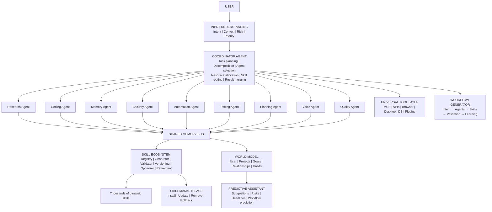
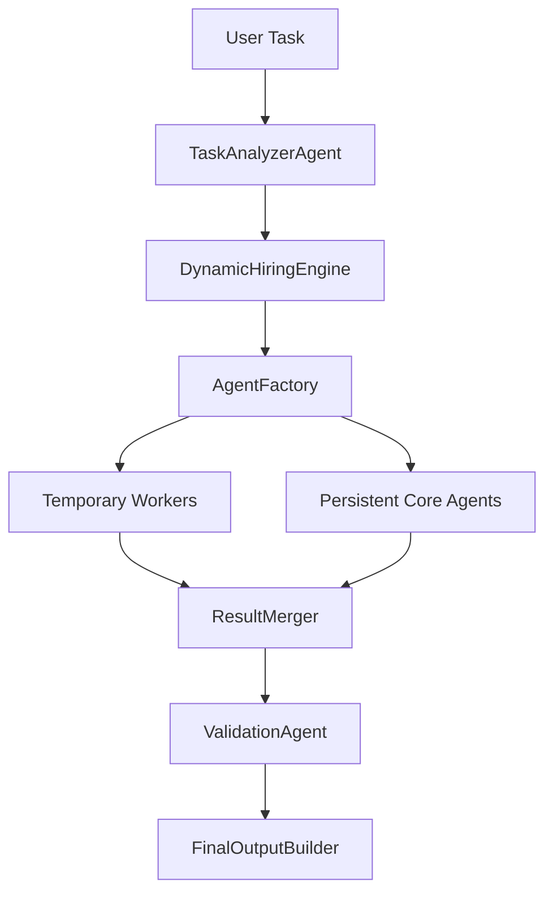

# Akansha / Hermes Cognitive Operating System

Hermes is an isolated cognitive layer for Akansha. It adds durable memory,
experience learning, skill versioning, bounded agent hiring, planning,
reflection, and safety validation without replacing the existing chat or voice
pipeline.

The latest adaptive layer extends Hermes beyond "agent routing" into an AI
operating system: cognitive compression, governed tool access, world modeling,
predictive assistance, adaptive UI modes, multimodal context, workflow
generation, background jobs, and a skill marketplace.

## Akansha Cognitive Core



### Persistent Core Agents

Hermes keeps nine stable core agents:

- ResearchAgent
- CodingAgent
- MemoryAgent
- SecurityAgent
- AutomationAgent
- TestingAgent
- PlanningAgent
- VoiceAgent
- QualityAgent

These agents use the shared memory bus and provide stable behavior across tasks.
They are deduplicated by name, bounded by the active-agent cap, and controlled by
the coordinator.

### Dynamic Worker System

Temporary workers are created only when task complexity requires parallelism.
They are not persisted to the database.

```text
complexity_score =
steps + tools + dependencies + uncertainty + estimated runtime

if complexity < 30: spawn 0 temporary workers
if complexity < 60: spawn 2 temporary workers
if complexity < 90: spawn 4 temporary workers
if complexity >= 90: spawn 6 temporary workers
```

Temporary workers:

- use isolated temporary memory
- have temporary lifespan
- cannot spawn other workers
- report only to CoordinatorAgent
- are auto-destroyed after completion

This reduces token use because simple work stays with the core agents, while
larger jobs get parallel analysis only when useful.

## Advanced Agent Army Pipeline

Hermes now exposes the complete production routing chain:



Pipeline objects:

- `TaskAnalyzerAgent`: converts text into intent, tools, dependencies, uncertainty, runtime, priority, risk, and complexity.
- `DynamicHiringEngine`: calculates persistent army size and temporary worker count.
- `AgentFactory`: deduplicates persistent core agents and creates non-persistent temporary workers.
- `ResultMerger`: merges worker outputs and detects conflicts.
- `ValidationAgent`: checks safety, confidence, and critical-risk conditions.
- `FinalOutputBuilder`: returns a final execution state: ready, blocked, or needs approval.
- `HermesMetrics`: tracks task allow/block counters and timing summaries.
- `FailureAnalysisEngine`: inspects low-reward experiences and recommends workflow fixes.

## Adaptive OS Extensions

### Cognitive Compression Engine

`CognitiveCompressionEngine` converts raw memory into a compact operating
context:

- extracts decisions
- extracts user patterns
- extracts lessons from failures
- archives low-confidence noise
- persists compression snapshots for audit

It never invents memories. It only compresses stored short-term and long-term
records.

### Universal Tool Layer

`UniversalToolLayer` provides one governance interface for:

- MCP tools
- APIs
- browser automation
- desktop automation
- databases
- plugins

It plans tool usage and approval boundaries. Sensitive desktop/browser actions
are blocked until approved.

### World Model Engine

`WorldModelEngine` stores graph nodes and edges for:

- users
- projects
- goals
- relationships
- behaviors
- deadlines
- preferences

This lets Akansha reason from a stable model of Yogesh, projects, habits, and
constraints instead of replaying entire old chats.

### Predictive Assistant

`PredictiveAssistant` uses task text, analysis, and learned failure lessons to
suggest the next best action. Examples:

- deployment tasks trigger environment-variable risk checks
- live questions trigger source validation
- artifact tasks trigger file verification
- deadlines trigger reminders or study/work plans

### Adaptive UI Engine

`AdaptiveUIEngine` chooses a mode configuration without mutating the frontend:

- coding
- research
- voice
- planning
- business
- creative

Each mode returns recommended panels, default artifacts, and the response style
the UI can use.

### Multimodal Context Graph

`MultimodalContextGraph` stores text, voice, screenshots, images, PDFs, video,
web pages, documents, audio, and spreadsheets in one session graph. Duplicate
items are deduplicated by stable fingerprints.

### Workflow Generation Engine

`WorkflowGenerator` converts intent into an auditable chain:

```text
User goal
→ task analysis
→ tool selection
→ agent selection
→ skill routing
→ validation
→ learning
```

### Background Autonomous Jobs

`BackgroundJobEngine` schedules bounded jobs for monitors, alerts, reminders,
updates, and scheduled tasks. Jobs have max-run caps and never execute in an
unbounded loop.

### Skill Marketplace

`SkillMarketplace` provides governed skill install, update, remove, and rollback
events. Marketplace skills must meet:

- confidence >= 0.85
- reward_score >= 0.80
- non-empty triggers and execution steps

Stable skills are not overwritten; updates create new versions with rollback
links.

## Safety Rules

- Persistent core agents are capped at 10 active agents.
- Temporary workers are capped at 6 per task and are not persisted.
- Duplicate agents are reused instead of spawned again.
- Sensitive tools require approval before execution.
- LoopGuard blocks repeated learning cycles.
- Skills are versioned and never overwritten.
- Stable skills are rollback targets for later versions.
- Memory insertion deduplicates by category and normalized content.
- Recall returns at most 10 memories.

## API Routes

Base prefix: `/api/cognitive`

- `GET /health`
- `POST /memory/short-term`
- `POST /memory/long-term`
- `POST /memory/recall`
- `POST /memory/compress`
- `POST /memory/cognitive-compress`
- `GET /memory/cognitive-compress/latest`
- `POST /experience`
- `POST /skills/generate`
- `POST /skills/promote`
- `POST /skills/optimize`
- `GET /skills/search?q=...`
- `GET /marketplace`
- `POST /marketplace/install`
- `POST /marketplace/update`
- `POST /marketplace/remove`
- `POST /analyze`
- `POST /plan`
- `POST /simulate`
- `GET /failures`
- `POST /failures/lesson`
- `GET /tools`
- `POST /tools/register`
- `POST /tools/plan`
- `GET /world`
- `POST /world/node`
- `POST /world/edge`
- `POST /predict`
- `POST /ui/mode`
- `POST /multimodal/ingest`
- `GET /multimodal/session/{session_id}`
- `POST /workflows/generate`
- `GET /background/jobs`
- `POST /background/jobs`
- `POST /background/jobs/run-due`
- `GET /metrics`
- `POST /loop/run-once`

## Databases

Hermes keeps its own SQLite files under `backend/hermes/database/`:

- `memories.db`
- `skills.db`
- `experiences.db`
- `agents.db`

These files are local runtime data and are ignored by Git through the existing
`*.db` rule.

Run migrations manually:

```bash
python -m backend.hermes.database.migrations
```

## Recall Formula

```text
RecallScore =
0.35 * semantic_similarity +
0.20 * importance +
0.15 * recency +
0.15 * usage_frequency +
0.15 * confidence
```

## Skill Promotion

A skill can be promoted only when:

- confidence >= 0.85
- reward_score >= 0.80
- it has passed validation

New versions keep a rollback pointer to the previous stable version.

## Dynamic Hiring

The coordinator calculates complexity from:

```text
task_steps * required_tools * estimated_runtime * uncertainty_score
```

Recommended temporary worker counts:

- complexity < 30: 0 workers
- complexity < 60: 2 workers
- complexity < 90: 4 workers
- complexity >= 90: 6 workers

## Tested Routing Examples

| Task | Intent | Workers | Skill routes | Strategy |
|---|---|---:|---|---|
| Remember Telugu plus English preference | conversation | 0 | MemoryCompressionSkill, WorkflowOptimizerSkill | persistent core only |
| Generate PDF and Excel report with validation | artifact_generation | 4 | PDFGenerationSkill, SpreadsheetAnalysisSkill, PresentationBuilderSkill | parallel worker merge |
| Research latest AI news and export PDF/Excel/PPT | live_research | 6 | DeepResearchSkill, NewsIntelligenceSkill, PDFGenerationSkill, SpreadsheetAnalysisSkill, PresentationBuilderSkill | parallel worker merge |
| Open browser and submit payment form | automation, critical risk | 4 after approval | BrowserAutomationSkill, VoiceCommandSkill | approval-gated workers |
| Debug voice assistant and run tests | coding | 4 | AutonomousDebugSkill, CodeReviewSkill, GitDeploySkill | debug workers plus validation |

## Adaptive OS Test Scenarios

| Scenario | Expected result |
|---|---|
| Store Telugu plus English preference, then compress memory | Compression snapshot contains decisions and user language pattern |
| Plan a desktop-control task without approval | Tool layer blocks desktop tool and marks approval required |
| Record deployment failure caused by missing env vars | Predictive assistant warns to validate env variables next time |
| Ingest duplicate screenshot context | Multimodal graph deduplicates and keeps one session item |
| Generate latest-news PDF workflow | Workflow includes live source validation and file verification |
| Install marketplace skill twice | Second install is rejected as already installed |
| Update marketplace skill | Creates a new version with rollback to previous package |
| Schedule a monitor job | Job is bounded by max_runs and becomes completed after execution |

The design keeps simple tasks cheap and stable, while multi-tool tasks use
temporary workers that cannot recursively spawn or write permanent memory.
